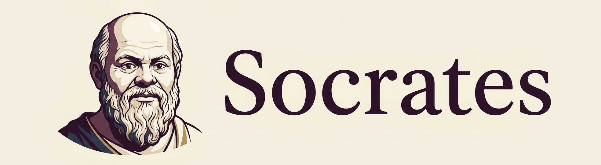
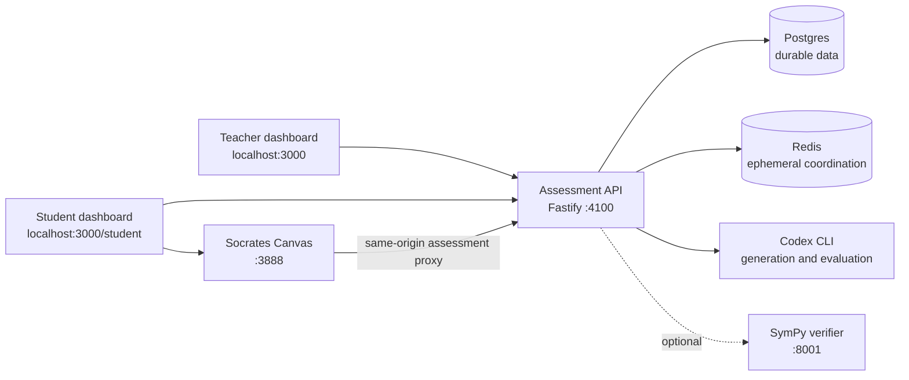

# Socrates

> A Canvas-first Physics diagnostic pilot that helps students make their thinking visible and gives teachers evidence they can inspect.



Socrates pairs an expressive visual Canvas with a supervised assessment workflow for introductory Physics.
Students work naturally with handwriting, equations, diagrams, and typed notes.
Teachers assign focused Mechanics diagnostics, review submitted evidence, and use uncertainty-aware competency signals to decide what to ask next.

This repository is a local pilot for developers, researchers, and educators who want to explore spatial AI learning and evidence-led assessment.
It is not production-ready educational infrastructure.

## Why Socrates

Most learning software asks students to fit their thinking into a sequence of text prompts.
Socrates starts with the page instead.

On Canvas, a student can draw a free-body diagram, cross out an equation, move a label, and show the intermediate work that led to an answer.
In learning mode, AI can inspect the relevant visual context and return an editable draft beside the work.
In assessment mode, those assistance controls are disabled so the Canvas becomes evidence of the student's own reasoning.

The teacher workflow connects that work to a curated, versioned Mechanics ontology.
Socrates records criterion-level evidence and updates competency beliefs as uncertain signals rather than reducing a student's work to one correct-or-incorrect score.

## What it includes

- **Socrates Canvas** - A sparse `20,000 x 20,000` workspace for pressure-sensitive ink, text, LaTeX, diagrams, panning, zooming, lasso edits, local history, and editable AI drafts.
- **Assessment mode** - A student-facing Canvas flow that disables AI assistance, captures a rendered work atlas and approved aggregate process features, and supports submission and follow-up prompts.
- **Teacher and student workspaces** - A Next.js dashboard for assignments, roster and evidence review, plus a student dashboard for starting assigned diagnostics and viewing progress.
- **Assessment API** - A Fastify service with cookie-based local authentication, durable Postgres records, Redis-backed coordination, a versioned Mechanics ontology, and competency-belief updates.
- **Model-backed generation and evaluation** - Codex CLI generates and critiques focused diagnostic items and evaluates visual evidence against declared criteria, with curated fallbacks when the model is unavailable.

## System overview



The Canvas sends assessment requests through its same-origin proxy to the assessment API.
Raw pointer-event arrays remain in browser-local storage.
The durable assessment request contains only the rendered work atlas, an optional written explanation, and a whitelisted set of aggregate features.

For a deeper look at Canvas architecture and its AI execution paths, read the [Canvas README](apps/canvas/README.md) and [architecture notes](apps/canvas/docs/architecture.md).

## Quick start

### Prerequisites

- Node.js 18.17 or later and npm.
- A reachable local Postgres instance.
- A reachable local Redis instance.
- An authenticated [Codex CLI](https://developers.openai.com/codex/cli) for model-generated items and visual evaluation.
- Python and the packages in `apps/verifier/requirements.txt` only if you want to run the optional SymPy helper service.

The assessment API falls back to curated diagnostic content and conservative evaluation when Codex is unavailable.
Codex is recommended for the complete local-pilot experience.

### Configure and run the local pilot

Copy the local service configuration and provide working Postgres and Redis URLs.

```bash
cp .env.example .env
npm install
```

Prepare the database and publish the current Mechanics ontology.

```bash
npm --workspace @socrates/api run db:migrate
npm --workspace @socrates/api run ontology:validate
npm --workspace @socrates/api run ontology:publish -- physics-mechanics-2026-2
```

Start the three core services in separate terminals.

```bash
# Terminal 1
npm run start:api

# Terminal 2
npm run start:canvas

# Terminal 3
npm --workspace @socrates/dashboard run dev
```

Optionally start the verifier in a fourth terminal after installing its Python dependencies.

```bash
python -m pip install -r apps/verifier/requirements.txt
npm run start:verifier
```

Open the teacher workspace at [http://localhost:3000](http://localhost:3000).
Open the student workspace at [http://localhost:3000/student](http://localhost:3000/student).
The Canvas is available at [http://localhost:3888](http://localhost:3888), and the API health endpoint is [http://localhost:4100/health](http://localhost:4100/health).

The local seed creates `teacher@socrates.local` and `aarav.shah@socrates.local`.
Both use the local-pilot password `1234`.
Do not use these credentials outside a local development environment.

### Configure Canvas AI assistance

Assessment mode works through the local assessment API.
For direct AI assistance in normal Canvas learning mode, configure Canvas separately with either an API provider or an authenticated Codex CLI.

```bash
cd apps/canvas
cp env.codex.example .env
codex login
npm start
```

See the [Canvas setup guide](apps/canvas/README.md#quick-start) for API mode, supported providers, configuration, and local-network safety guidance.

## Repository guide

| Path | Purpose |
| --- | --- |
| [`apps/canvas`](apps/canvas) | Browser Canvas, AI draft system, assessment mode, and the Canvas server. |
| [`apps/dashboard`](apps/dashboard) | Next.js teacher workspace and student dashboard. |
| [`apps/api`](apps/api) | Fastify assessment API, database migrations, durable repository, ontology, and tests. |
| [`apps/verifier`](apps/verifier) | Optional FastAPI and SymPy helper service. |
| [`AGENT_HANDOFF.md`](AGENT_HANDOFF.md) | Implementation-accurate architecture, API surface, data model, workflows, and known limitations. |
| [`USER_FLOWS.md`](USER_FLOWS.md) | Teacher, student, Canvas, assessment, and maintenance flow reference. |

## Development checks

Run the regular API and Canvas suites together.

```bash
npm test
```

Run the API suite alone.

```bash
npm --workspace @socrates/api test
```

Run durable API integration coverage with local Postgres and Redis.

```bash
SOCRATES_INTEGRATION_TESTS=true npm --workspace @socrates/api test
```

Run the Canvas suite.

```bash
npm --workspace @socrates/canvas test
```

Build the dashboard before validating a production-style frontend build.

```bash
npm --workspace @socrates/dashboard run build
```

Do not run the dashboard build while `next dev` is serving the same workspace.
Restart the development server if a build replaces its active `.next` assets.

## Current boundaries

Socrates is deliberately scoped to a local supervised Mechanics diagnostic pilot.
It uses local password authentication, local HTTP origins, and developer-managed services.

Before a production deployment, the project needs production authentication and password recovery, secure cookies and TLS, strict deployment-specific CORS, a real background work queue, browser end-to-end coverage, and a deployment configuration with appropriate database permissions.
The SymPy verifier is provisioned as an optional helper but is not yet part of the generated-item transaction.

Read [AGENT_HANDOFF.md](AGENT_HANDOFF.md) for the full implementation state and prioritized next work.

## License

The Canvas package is licensed under [GNU AGPL v3.0 only](apps/canvas/LICENSE).
This repository does not currently declare a root-level license.
