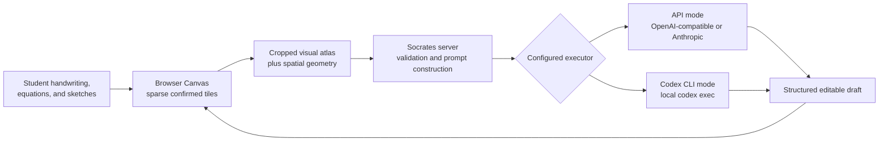
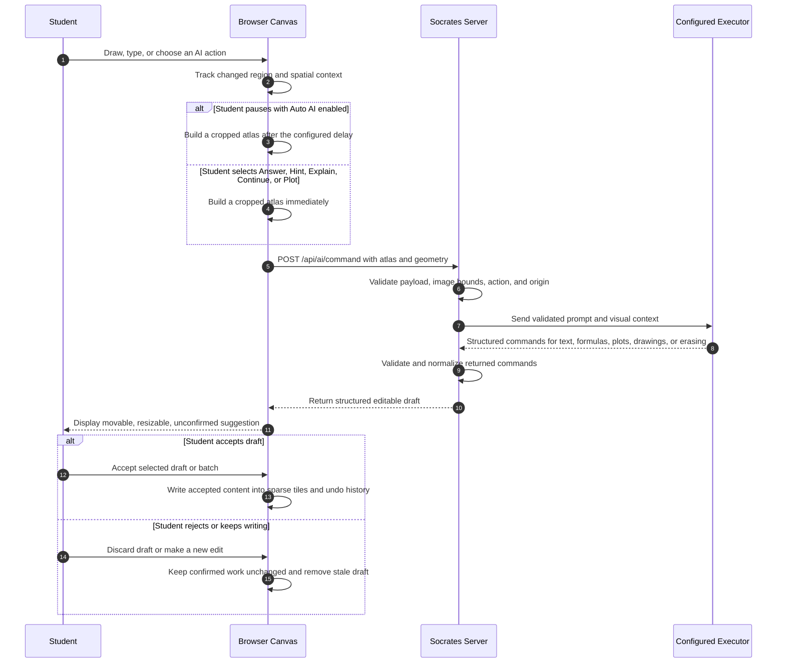
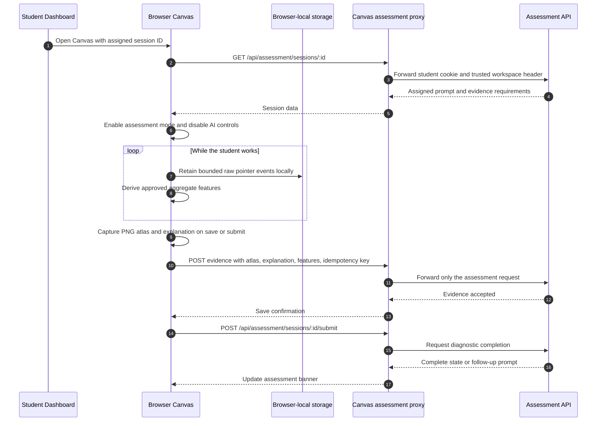

# Socrates Canvas

## Inspiration

Students do not think in a neat sequence of chat messages.
They sketch a free-body diagram, cross out an equation, place an arrow beside a label, and make space for the next idea.
That spatial work is often the reasoning itself, especially in K-12 subjects such as mathematics and science.

Socrates began with the belief that a learning tool should meet students where that work happens.
Instead of asking them to translate every diagram, handwritten step, or half-formed idea into a text prompt, Socrates makes the canvas part of the conversation.
A student can put a question, equation, or sketch anywhere on the page, pause, and receive help beside the work that prompted it.

The other part of the inspiration was agency.
AI should be able to see the context of a student's work without taking over the page or silently rewriting their reasoning.
Socrates therefore treats AI output as a suggestion that students can inspect, move, resize, accept, or discard.

## What it does

Socrates is a shared canvas for handwriting, equations, diagrams, and spatial questions.
Students can draw with a stylus or mouse, type plain text or LaTeX, pan and zoom across a large workspace, and use a freehand lasso to move, resize, or recolor selected ink.
The interaction feels closer to a working notebook or whiteboard than to a conventional chat interface.

In learning mode, Socrates can answer questions, offer hints, continue an idea, explain work, create formulas, plot functions, or draw diagrams directly on the canvas.
It does not flatten those responses into a chat transcript.
Instead, each response returns as a structured, editable draft positioned near the relevant work and kept separate from the student's confirmed ink until the student chooses to accept it.

The same surface also supports an assessment mode for an assigned diagnostic.
Assessment mode displays the prompt in the canvas experience, enables a written explanation when the task calls for one, and disables both automatic and manual AI assistance.
Students still work naturally with ink, text, LaTeX, diagrams, and edits, but the submitted workspace becomes evidence of their reasoning rather than a place where the product supplies an answer.

### Canvas learning flow

The diagram shows why the canvas is more than a drawing input.
The browser sends the relevant visual context and geometry to the server, which selects the configured model execution path and returns a proposal that remains under the student's control.

## How we built it

I built Socrates around a `20,000 x 20,000` logical canvas without allocating a `20,000 x 20,000` browser bitmap.
Confirmed content is stored in sparse `512 x 512` tiles, and the renderer composites only the tiles that are visible in the viewport.
That makes an expansive workspace practical while preserving responsive drawing, panning, zooming, selection, history, and export behavior.

The canvas supports pressure-sensitive ink, erasing, direct plain-text and LaTeX placement, local undo and redo, and browser-local snapshots backed by IndexedDB.
The lasso tool clips only the pixels inside a freehand selection path, so moving or recoloring a small portion of a tile does not disturb nearby work.
Unconfirmed AI drafts are intentionally excluded from local snapshots, which keeps saved student work distinct from tentative suggestions.

For an AI interaction, the browser tracks the latest meaningful input region and builds a cropped visual atlas with its geometry and hotspot information.
The atlas is bounded to `2048 x 1536` pixels before it leaves the browser.
The Node.js server validates the image, geometry, action, and request shape before sending the request either to an OpenAI-compatible or Anthropic-compatible API endpoint, or to an authenticated local Codex CLI process.
The browser validates the structured response again before rendering it as an editable draft.

### From a mark to an editable response

This flow avoids treating a model response as an irreversible edit.
It also gives the model visual grounding through the atlas and geometry rather than asking the student to reproduce their entire page in text.

## Challenges we ran into

The hardest problem was performance on an effectively infinite canvas.
The simple approach of allocating one large bitmap would make drawing and exporting unreliable or prohibitively expensive.
Sparse tiles made the large logical workspace possible, but they also required careful design for viewport compositing, tile-level history, lasso clipping, draft confirmation, and atlas generation.

Grounding AI output in the right place was another challenge.
The server needs enough context to distinguish the newest equation or sketch from older work elsewhere on the page, while the client needs to prevent malformed or out-of-bounds output from corrupting the workspace.
Socrates handles this with bounded visual atlases, changed-region geometry, hotspot metadata, server-side validation, client-side command validation, and an unconfirmed draft layer.

Assessment created a different tension.
The normal canvas is intentionally helpful, but a diagnostic must let students demonstrate their own reasoning.
The solution was to preserve the same drawing surface while suppressing AI at both the visible-control and runtime layers, then collect only the assessment evidence needed for review.

### Assessment evidence and privacy boundary

Raw pointer-event arrays remain in browser storage and are not part of the durable assessment request.
The browser sends a rendered PNG atlas, the student's explanation, and a whitelisted aggregate feature set through a same-origin proxy, which forwards the existing student cookie and prevents browser code from choosing an arbitrary assessment-service origin.
That boundary lets Socrates retain useful evidence while avoiding centralized raw stroke streams.

## Accomplishments that we're proud of

I am most proud that Socrates turns one expressive canvas into two coherent experiences.
In learning mode, it is an AI-assisted workspace where help appears in context and stays editable.
In assessment mode, it becomes a focused environment where students can still work naturally but cannot invoke hints, answers, explanations, continuations, or plots from the AI.

The draft model is another important accomplishment.
AI suggestions are not silently merged with student work, and they are not trapped in a separate chat panel.
They occupy the same spatial workspace while clearly remaining provisional until the student accepts them.

The privacy boundary is equally intentional.
Socrates can capture a visual record of submitted work and limited process summaries for assessment while retaining raw event data locally in the browser.
That is a more respectful starting point for K-12 learning tools, where the value of understanding a student's process should not require indiscriminate behavioral collection.

## What we learned

We learned that context matters as much as content.
An equation alone can be ambiguous, but an equation beside a diagram, arrow, label, or previous step can make the student's intent much clearer.
A canvas gives an AI system a way to reason about that context without demanding that students adapt their thinking to a chat box.

We also learned that helpfulness needs boundaries.
For practice, students benefit from contextual hints and editable explanations.
For assessment, the product must step back, preserve student agency, and make the evidence boundary explicit.

Finally, building an infinite canvas reinforced that interaction quality is part of the product's pedagogy.
If drawing feels delayed, selection destroys nearby work, or AI responses overwrite a student's page, the tool interrupts the very thinking it is meant to support.

## What's next for Socrates

The next step is to pilot Socrates Canvas with K-12 students and teachers.
I want to learn which kinds of spatial work students naturally create, when visual AI help is genuinely useful, and what teachers consider meaningful evidence of understanding.

That feedback will guide improvements to recognition, visual tools, pen interaction, and the assessment experience.
The goal is not to replace a student's notebook or a teacher's judgment.
It is to build a more expressive digital space where students can think visibly and receive support that respects how learning actually happens.
