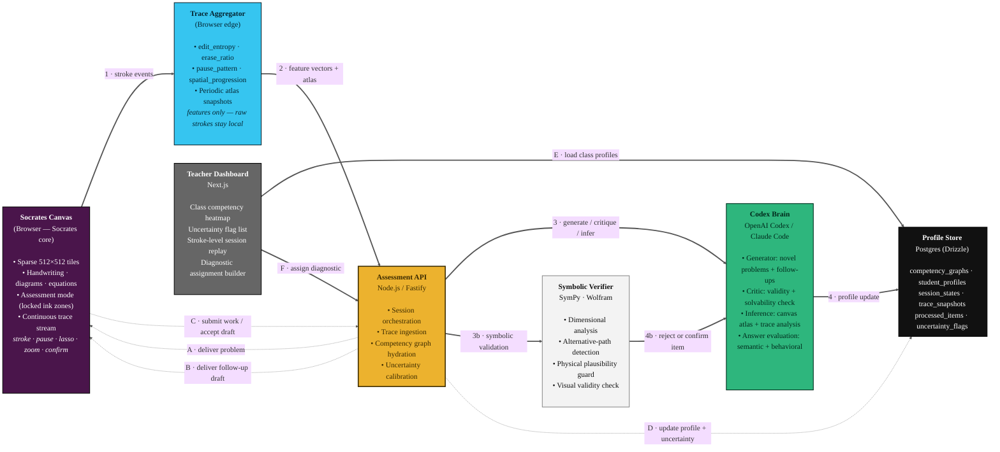
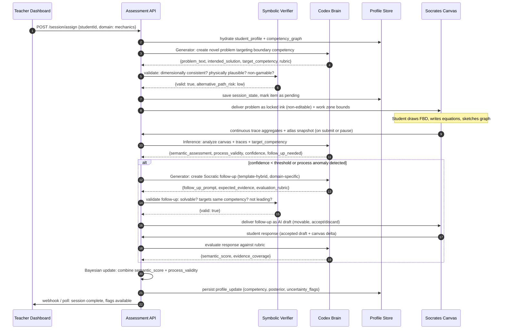
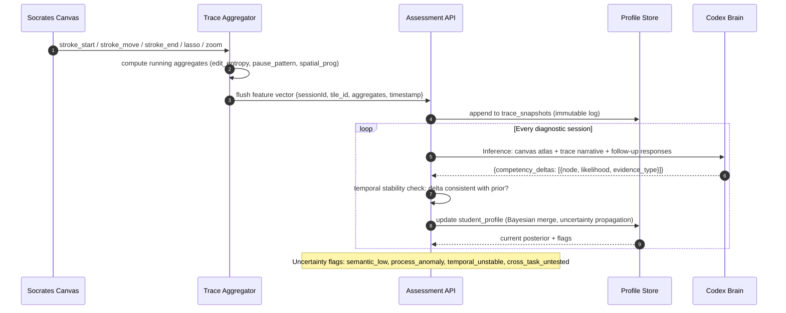
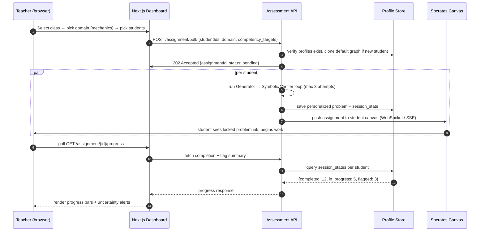
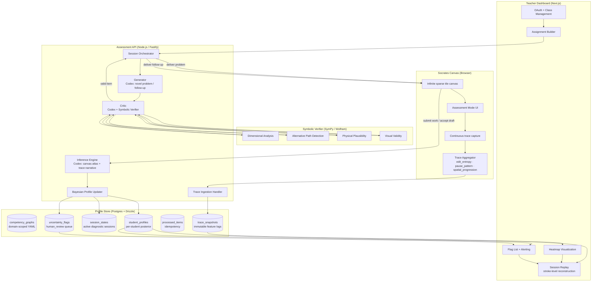
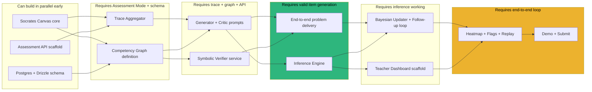

Here is the architecture document for Socrates.

---

# TECHNICAL_ARCHITECTURE.md — SOCRATES

_"Who actually knows this?" — not who copied it._

This document shows how the Socrates assessment engine connects to the Socrates canvas (rebranded as the Socrates student workbench), how data flows from a student's stroke on an infinite canvas into a probabilistic competency profile, and how a teacher sees what that student actually understands.

---

## 0. Architecture at a glance (submission diagram)

Render to PNG/SVG at **[mermaid.live](https://mermaid.live)** (paste → Export at 2–3× scale).  
Six boxes, two loops: solid arrows = **ingest** (1–4), dashed arrows = **assess** (A–D).



> **Reads in one breath:** The student draws on an infinite canvas; the browser aggregates behavioral features and sends them with periodic snapshots to the Assessment API, which orchestrates a Codex Brain that generates novel problems, validates them through a symbolic verifier, and infers competency states from the student's work. The Profile Store holds the evolving Bayesian graph for every student. The Teacher Dashboard assigns diagnostics and reads the profile state back out as a heatmap of understanding, not a grade.

### The two core behaviors (sequence view)

**Diagnostic Session — a novel problem becomes a Socratic interview**


**Profile Evolution — from first session to longitudinal model**


**Teacher assigns diagnostic — from dashboard to live canvas**


### The ranking that makes it work (the differentiator)

```
posterior(competency) = α · prior(competency) + β · semantic_evidence + γ · process_evidence

  semantic_evidence  = evaluation of follow-up response against rubric (0–1)
  process_evidence   = f(edit_entropy, erase_ratio, pause_pattern, spatial_progression)
                       normalized against population baseline for this competency
  α, β, γ            = calibrated per domain; β + γ > α ensures the assessment
                       dominates the prior, but temporal stability prevents oscillation

  uncertainty_flag   = max(semantic_confidence, process_validity, temporal_stability) < τ
                       → human review required before acting on inference

⇒ The system does not score right/wrong. It updates a belief distribution over
  a fine-grained competency graph, and it knows when it does not know.
```

### ASCII fallback (if a renderer isn't available)

```
┌─────────────────────────────────────────────────────────────────────┐
│  STUDENT: Socrates Canvas (Browser)                                │
│  Infinite sparse tiles · handwriting · diagrams · equations       │
│  Assessment mode: locked problem ink · work zones · AI drafts     │
│  Continuous trace: stroke · pause · lasso · zoom · confirm        │
└──────────────────┬──────────────────────────────────▲─────────────┘
                   │ feature vectors + atlas           │ problem / follow-up
                   ▼ (periodic flush)                │ (delivered as draft)
┌─────────────────────────────────────────────────────────────────────┐
│  TRACE AGGREGATOR (Browser edge)                                     │
│  edit_entropy · erase_ratio · pause_pattern · spatial_progression   │
│  Raw strokes stay local for replay; only aggregates leave client    │
└──────────────────┬──────────────────────────────────────────────────┘
                   │
                   ▼
┌─────────────────────────────────────────────────────────────────────┐
│  ASSESSMENT API (Node.js / Fastify) — Session Orchestrator          │
│  ┌─────────────┐  ┌─────────────┐  ┌─────────────────────────┐   │
│  │ Generator   │  │ Critic      │  │ Inference Engine        │   │
│  │ (Codex)     │──►│ (Codex +    │  │ (Codex: canvas + traces │   │
│  │ novel items │  │  Symbolic)   │  │  + follow-up eval)      │   │
│  └─────────────┘  └─────────────┘  └─────────────────────────┘   │
│         │                ▲                      │                   │
│         │    validate    │              analyze │                   │
│         ▼                │                    ▼                    │
│  ┌─────────────────────────────────────────────────────────┐     │
│  │ SYMBOLIC VERIFIER (SymPy / Wolfram)                     │     │
│  │ • Dimensional analysis · Alternative-path detection      │     │
│  │ • Physical plausibility · Visual validity              │     │
│  └─────────────────────────────────────────────────────────┘     │
│         │                                                        │
│         ▼                                                        │
│  ┌─────────────────────────────────────────────────────────┐     │
│  │ PROFILE STORE (Postgres + Drizzle) — per student        │     │
│  │ competency_graphs · student_profiles · session_states     │     │
│  │ trace_snapshots · processed_items · uncertainty_flags   │     │
│  └─────────────────────────────────────────────────────────┘     │
│         ▲                                                        │
│         │ read / write                                           │
│  ┌─────────────────────────────────────────────────────────┐     │
│  │ TEACHER DASHBOARD (Next.js)                              │     │
│  │ OAuth · class heatmap · uncertainty flags · replay        │     │
│  └─────────────────────────────────────────────────────────┘     │
└─────────────────────────────────────────────────────────────────────┘
```

---

## 1. System Architecture

This is the full picture: how a student's stroke on a canvas becomes a calibrated belief about what they understand.



**Key design point to keep visible in your head:** The `student_profile` is the only place "understanding" actually lives — a probability distribution over the competency graph, scoped per student, with explicit uncertainty flags. Everything else is plumbing to get evidence into that distribution and to surface it back out as a teacher-actionable heatmap. If you're ever unsure what to build next, ask: "does this get me closer to a valid, stable, decision-relevant posterior, or to surfacing uncertainty honestly?"

> **Implementation notes (current build).** The Socrates canvas runs as a **sparse tile renderer** in the browser — only 512×512 tiles where ink exists are allocated, so the 20,000×20,000 logical canvas never becomes a memory burden. In **Assessment Mode**, the canvas locks problem ink as non-editable confirmed tiles, while student work zones remain freeform. The AI does not auto-respond to pauses; it only delivers follow-ups as **draft tiles** (movable, resizable, accept/discard) when the Inference Engine triggers a probe. The Trace Aggregator runs entirely in the browser: it computes `edit_entropy`, `erase_ratio`, `pause_pattern`, and `spatial_progression` from raw stroke events, then flushes **feature vectors** (not raw biometrics) to the Assessment API. Raw stroke logs stay in IndexedDB for session replay and are never transmitted. The Assessment API maintains **session state** in memory (Redis-backed for horizontal scaling) and persists only profile updates and trace snapshots to Postgres. The Generator and Inference Engine call Codex over **Streamable HTTP** with distinct system prompts and temperature settings (Generator: creative, t=0.7; Critic: conservative, t=0.2; Inference: analytical, t=0.3). The **Symbolic Verifier** is a separate Python service (FastAPI) wrapping SymPy; it receives the intended solution and checks dimensional consistency, alternative solution paths, and physical plausibility. The Critic rejects up to 3 generations before escalating to a fallback pre-authored item pool. The Bayesian Updater uses a simple **conjugate beta-binomial model per competency node** for interpretability and auditability; uncertainty flags fire when the posterior variance exceeds a domain-tuned threshold. The Teacher Dashboard reads the same Postgres store over a **REST + WebSocket** layer, with row-level security ensuring teachers see only their class profiles. Session Replay reconstructs the canvas from local IndexedDB stroke logs (pulled via secure short-lived token) combined with server-side feature annotations, so teachers see *where* the student paused and *what* they erased, not just a video recording.

---

## 2. Step-by-Step Technical Roadmap

This is the literal build order — each step assumes the previous one is done and runnable.

```mermaid
graph TD
    A[1. Scaffold Socrates Canvas core<br/>sparse tiles · stroke capture · basic drawing] --> B[2. Add Assessment Mode<br/>locked ink zones · work boundaries · draft/confirm separation]
    B --> C[3. Build Trace Aggregator<br/>edit_entropy · pause_pattern · spatial_progression]
    C --> D[4. Scaffold Assessment API<br/>Fastify · session routes · trace ingestion]
    D --> E[5. Define Competency Graph schema<br/>K-12 Mechanics · 20 nodes · prerequisites · evidence criteria]
    E --> F[6. Build Profile Store<br/>Postgres · Drizzle · student_profiles · uncertainty_flags]
    F --> G[7. Write Generator prompt + Critic prompt<br/>test manually on 10 sample physics problems]
    G --> H[8. Wire Symbolic Verifier<br/>SymPy service · dimensional analysis · alt-path check]
    H --> I[9. Connect Generator → Critic → Canvas<br/>end-to-end: teacher assigns → student sees problem]
    I --> J[10. Add Inference Engine<br/>canvas atlas + trace analysis → competency evaluation]
    J --> K[11. Build Bayesian Updater<br/>posterior merge · temporal stability · uncertainty flags]
    K --> L[12. Wire Socratic Follow-up loop<br/>submit → infer → generate probe → deliver draft → evaluate]
    L --> M[13. Validate Phase 3 checkpoint<br/>diagnostic session completes · profile updates · flags surface]
    M --> N[14. Build Teacher Dashboard<br/>Next.js · OAuth · class picker · assignment builder]
    N --> O[15. Add Heatmap + Flag List views]
    O --> P[16. Add Session Replay<br/>stroke reconstruction from IndexedDB + feature overlay]
    P --> Q[17. Stress test: 30-student class · concurrent sessions · backfill replay]
    Q --> R[18. Demo video + architecture diagram + text description]
    R --> S[19. Submit]

    style A fill:#4A154B,color:#fff
    style M fill:#2EB67D,color:#000
    style S fill:#ECB22E,color:#000
```



**Read this as a checklist, not a suggestion** — steps 1–6 are pure infrastructure with no payoff until step 9, where a student first sees a generated physics problem on their canvas. Step 13 is the actual "does this project work" milestone. Everything after that is demoability and packaging.

---

## 3. Dependency Flowchart (what blocks what)

This shows which steps can happen in parallel and which strictly require something else first.



---

**Key note:** The Socrates canvas preserves all Socrates properties — no npm runtime dependencies, sparse tile allocation, local snapshot storage, and AGPL licensing. The assessment engine adds only the trace aggregator (vanilla JS), the Assessment API (Node.js), and the Symbolic Verifier (Python/FastAPI). The Codex Brain is a prompt-orchestration layer, not a hosted model.
